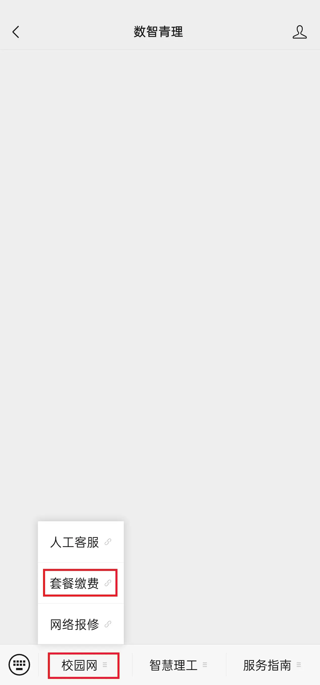
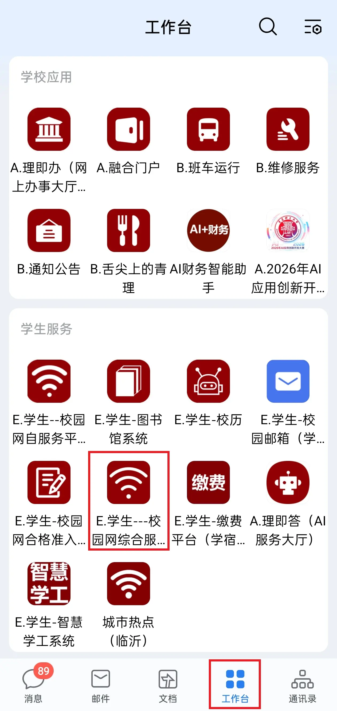
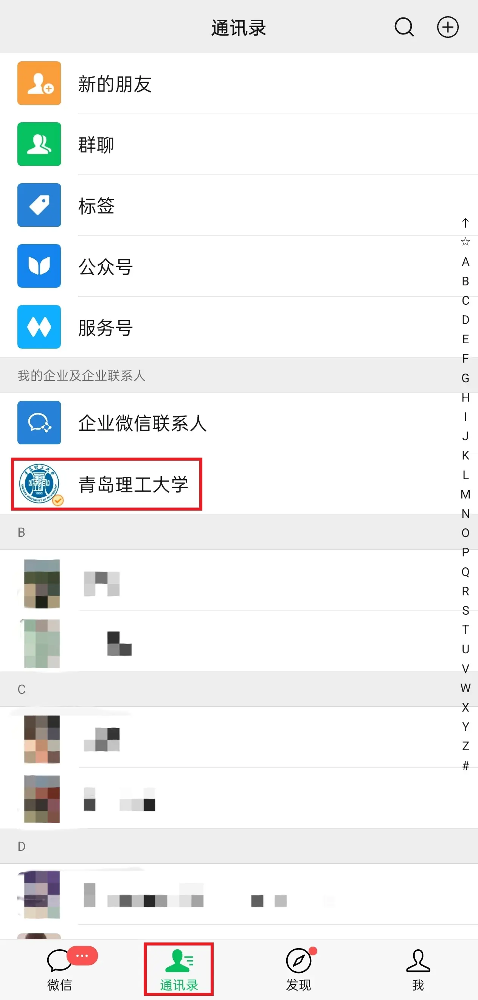
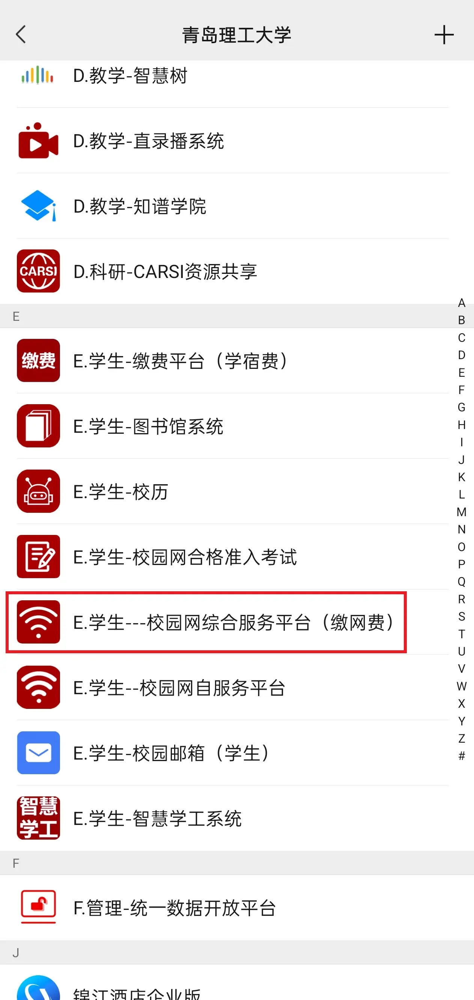
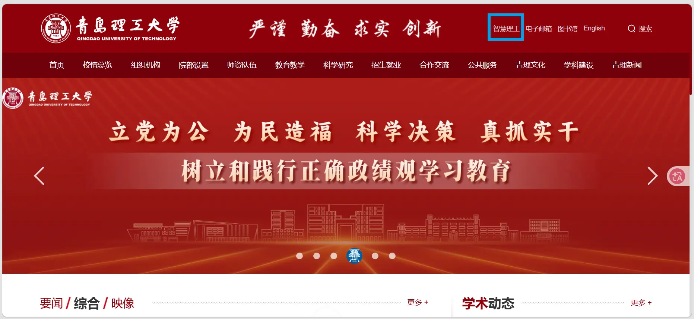
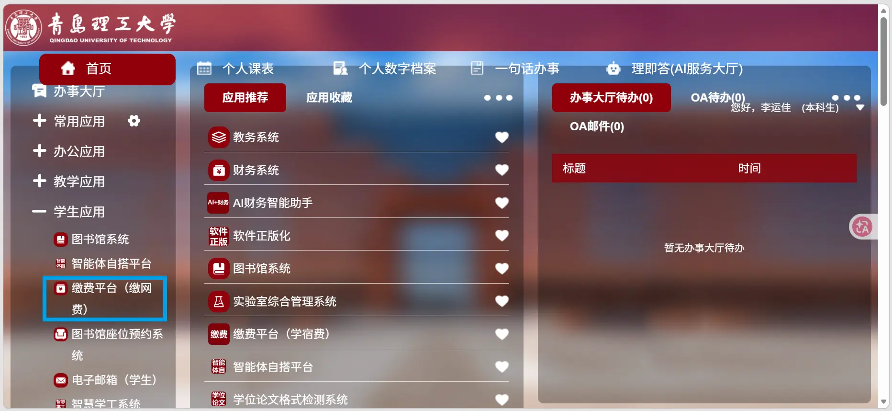

# 校园网

>校园网为我们提供了性价比较高的在校内接入网络的渠道，本文搜集了校园网的套餐类型、缴费方式和登录方式。请注意，青理的所有官方网站/系统都不限制仅校园网可访问，可根据自身需求决定校园网开通情况。

## 购买方式

手机端可在微信数智青理公众号中缴费；或在加入青岛理工大学企业微信号（开学后学校会组织加入）后，于 企业微信 -> 工作台 或 微信通讯录 -> 青岛理工大学 中缴费。

电脑端可在青岛理工大学官网右上角智慧理工中缴费。

通过青岛理工大学企业微信号中的学生--校园网自服务平台，还可查询已用时长、已用流量、近期上网记录等信息（登录需智慧理工密码，默认为身份证后六位）。

- 在数智青理公众号中缴费：

    首先关注数智青理公众号。

    

    点击私信，在右下角 校园网 -> 套餐缴费 中即可缴费。

    流程如下图所示：

    

- 在企业微信中缴费：

    在加入青岛理工大学企业微信号后，可在 企业微信 -> 工作台 -> 学生服务 -> 学生--校园网综合服务平台（缴网费） 缴费。

    流程如下图所示：

    

- 在微信中缴费：

    在加入青岛理工大学企业微信号后，可在 微信 -> 通讯录 -> 青岛理工大学 -> 学生--校园网综合服务平台（缴网费） 缴费。

    流程如下图所示：

    
    

- 在电脑端缴费：

    在电脑端可登录[青岛理工大学官网](https://vpnportal.qut.edu.cn)，然后点击右上角智慧理工，通过“统一身份认证”（账号为学号，首次登录默认密码为qut加身份证后八位）后，点击右侧 学生应用 -> 缴费平台（缴网费） 进行缴费。

    流程如下图所示：

    
    

## 套餐类型

青理当前的套餐有五种类型（以下为校园网综合服务平台原文）：

1. 10元学习型套餐

    该套餐按固定期限30天为一个计费周期，该套餐仅能满足学生学习访问校内应用及下载论文等学习科研类场景使用，上网速率较低20Mbps，且仅能同时登录2台设备。

2. 30元畅享套餐

    该套餐按30天为1计费周期，套餐上网速率100Mbps、不限流量、支持4K视频的流畅播放，满足用户多场景、个性化需求，支持同时登录4台设备。

3. 100元学期无忧套餐

    缴费一次可使用一学期，在月初无须担心账号因忘记缴费而停机，该套餐有较快的上网速度60Mbps且无流量限制。可满足大部分同学的用网需求，可支持同时登录3个设备。

4. 180元包年无忧套餐

    缴费一次可使用一年，在月初无须担心账号因忘记缴费而停机，该套餐有较快的上网速度60Mbps且无流量限制，可支持同时登录3台设备。

5. 240元包年畅享套餐

    无须担心账号因忘记缴费而停机，套餐上网速率100Mbps、不限流量、支持4K视频的流畅播放，满足用户多场景、个性化需求，支持同时登录4台设备。

>根据个人使用体验，校园网在宿舍、教学楼等地使用尚可，但在建筑物外使用体验一般。本人为流量、校园网搭配使用，目前开通的是10元/月套餐。

## 登录方式

缴费成功后，在电脑/手机上搜索附近的无线网络信号，选择校园网（QUT-POL）并点击连接。

成功连接校园网后，设备会自动跳转至认证校园网登录页面。如未自动跳转，请点击“打开浏览器并连接”，或手动进入[校园网登录页面](http://net.qut.edu.cn)。

校园网账号登录后，显示“您已成功登录”，可正常访问网络。

## PS

新生入学季，也是校园电话卡推销高峰，可能会有许多所谓的学长学姐或“学校人士”向你推销电话卡。

不要轻信他们不办理校园电话卡就无法使用校园网/校内系统之类的话术，不办理校园电话卡不会对你的大学生活造成任何影响。另外要注意，校园电话卡声称的“大流量”绝大部分都是校园流量，仅可在学校内部和学校附近极其有限的区域使用（似乎是3km？）。

请不要被推销的言论裹挟，根据自身实际需要酌情办理校园电话卡。

另：遇到其他问题可拨打校园网服务热线0532-68975649，或通过数智青理公众号中的人工客服反馈。
